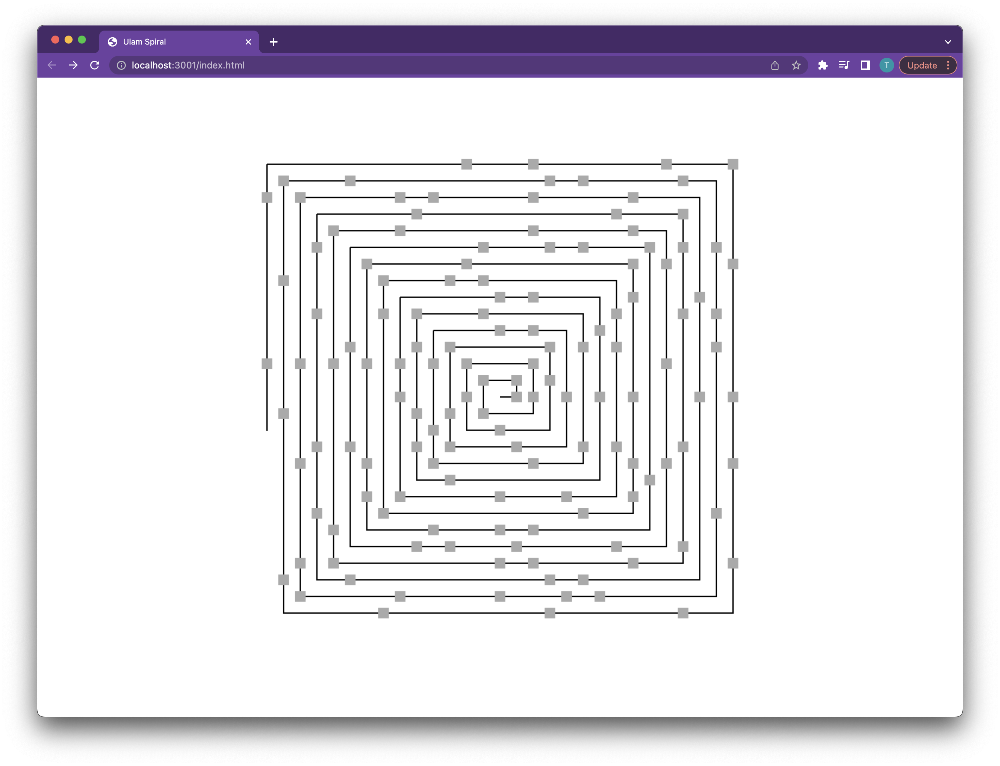

# Ulam Spiral

Inspired by [this video](https://www.youtube.com/watch?v=a35KWEjRvc0) by Daniel
Shiffman I decided to give this one a try.

Implemented in C using SDL2 and compiled to WebAssembly using Emscripten.

**TL;DR**
The idea of the Ulam spiral is that it renders a spiral placing marks (nodes) on
every spot that is a prime number.

## Get up and running

**Prerequisites**
Assuming you have [Emscripten](https://emscripten.org/) installed

```bash
$ git clone git@github.com:Tmw/ulam.git && cd ulam
$ make serve &
$ make
```
This will clone the repo, start the dev server in the background and start
building the source.

## Screenshot


## Demo
See the [live demo here](https://tmw.github.io/ulam/).

## License
[MIT](./LICENSE)
